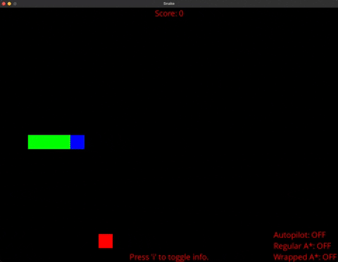
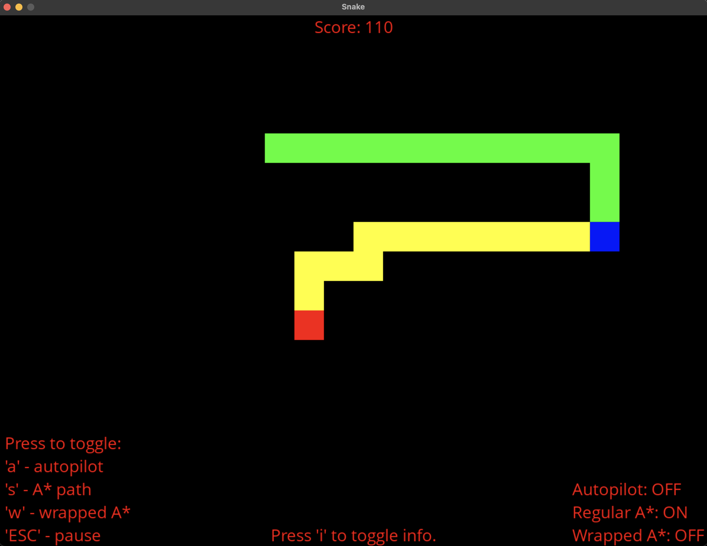
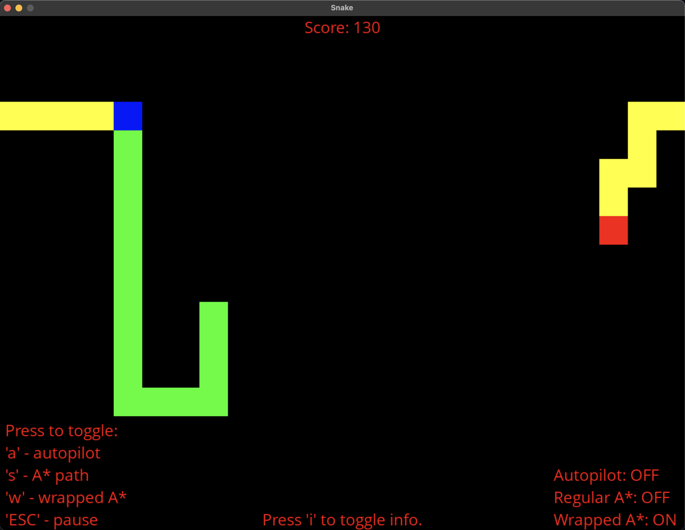

# SDL2-Snake
Snake game written using SDL2 library with the option to turn on continuous calculation of shortest paths using A* path finding algorithm and enabling autopilot.

Compiled with provided Makefile.

